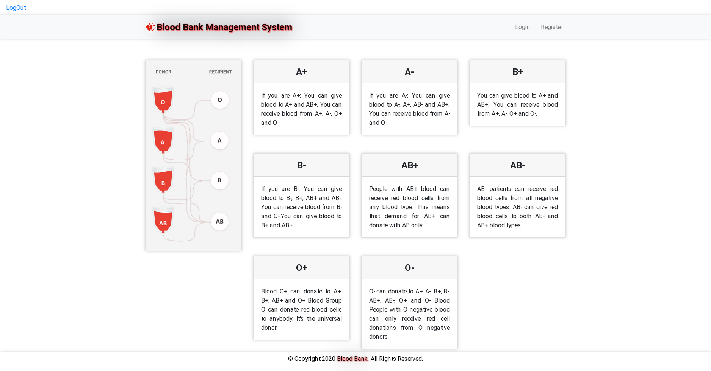

# Blood Bank Management System Deployment

Setting up BBMS application with Terraform and Ansible on local machine with VirtualBox.

# Prerequisites

- Terraform >= 1.8.2
- Ansible >= 2.16.6
- VirtualBox
- 1 GB RAM

# Getting started

All you need is to start terraform with `terraform apply` and wait for infrastructure to be created and provisioned with Ansible.

# Screenshots

# Credits

Chandana047 for creating this application
